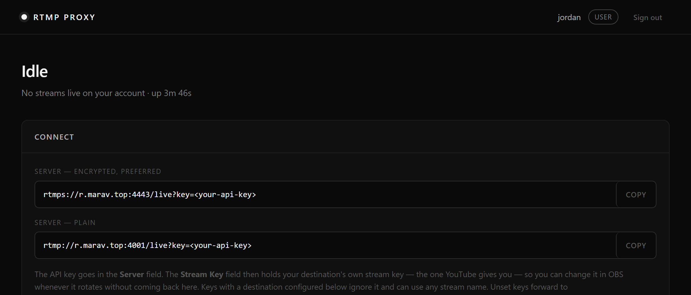
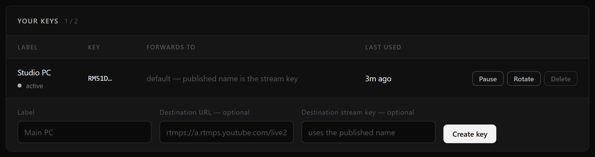
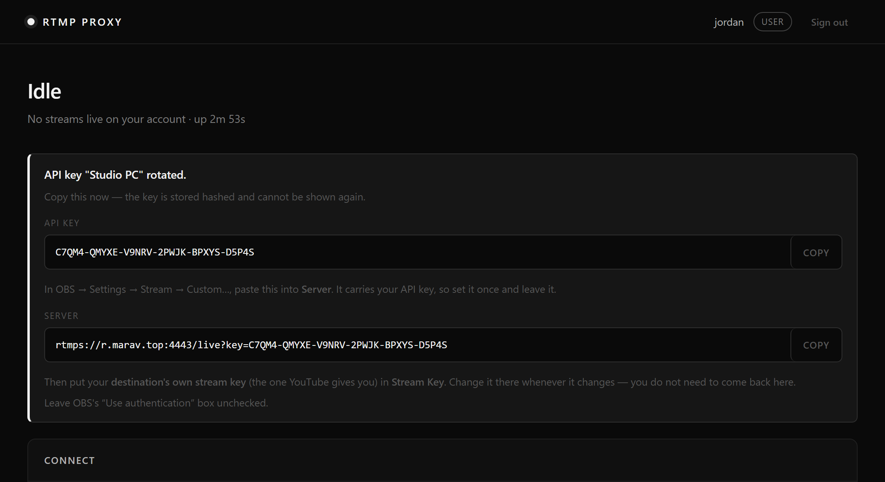
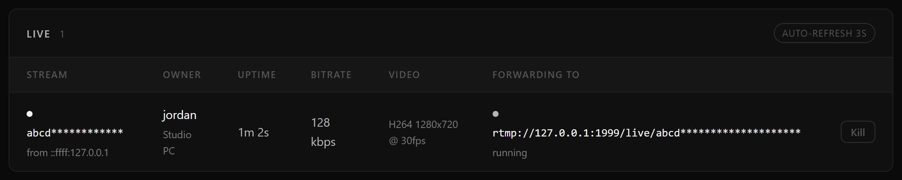

# Streaming through the RTMP proxy — user guide

This server sits between your streaming software and YouTube. You send your stream here, and it
forwards it on. You get one address to configure once, and a dashboard to see whether you are live.

**Dashboard:** <https://r.marav.top/>

---

## 1. Sign in

Your administrator creates your account and gives you a username and password.

---

## 2. Create an API key

An **API key** is your password for streaming. Everything you send has to carry one.

On the dashboard, find **Your keys** at the bottom, type a label that reminds you which machine it
is for — `Studio PC`, `Laptop` — and press **Create key**. Leave the two optional destination
fields blank.

Most accounts can hold **two** keys. Ask an administrator if you need more.

---

## 3. Copy your Server address

As soon as the key is created, the page shows it **once**:

Press **COPY** next to **Server**. That URL already contains your API key — it is the only thing
you need to paste.

> **This is shown once and never again.** The server stores only a scrambled version, so it cannot
> show it to you later. If you lose it, press **Rotate** on the key to get a new one.
>
> Treat the Server URL like a password. Anyone who has it can stream through your account.

---

## 4. Set up OBS

**Settings → Stream → Service: `Custom...`**

| Field | What to put |
| --- | --- |
| **Server** | The URL you just copied, e.g. `rtmps://r.marav.top:4443/live?key=YOUR-API-KEY` |
| **Stream Key** | **Your YouTube stream key** — the one YouTube gives you |
| **Use authentication** | Leave **unchecked** |

<!-- Screenshot of the OBS Stream settings page goes here. -->

Press **OK**, then **Start Streaming**.

Two things worth knowing:

- Use the `rtmps://` address (port 4443) rather than `rtmp://` (port 4001) where you can. `rtmps` is
  encrypted, so nobody on your network can read your keys.
- **Leave "Use authentication" unchecked.** It looks like it should hold your API key, but it does
  not work with this server. Your key goes in the Server field.

---

## 5. Changing your YouTube stream key

This is the part that saves you time. When YouTube gives you a new stream key:

**Change it in OBS. That's it.** Paste the new key into OBS's **Stream Key** box and carry on. You
do not need to sign in here or change anything on the dashboard.

The **Server** field stays exactly as it is, forever, unless you rotate your API key.

---

## 6. Check that you are live

The dashboard shows your stream within a few seconds of starting. It refreshes on its own.

| Column | Meaning |
| --- | --- |
| **Stream** | Your stream key, mostly hidden, and the address you are connecting from |
| **Uptime** | How long you have been streaming |
| **Bitrate** | How much data is arriving. If this is far below what you set in OBS, your upload is struggling |
| **Video** | Resolution and frame rate the server is receiving |
| **Forwarding to** | Where your stream is being sent, and whether that is working. **running** is what you want |
| **Kill** | Stops the stream immediately |

*(The screenshot was taken on a test setup, so "Forwarding to" shows a local test address. Yours
will show YouTube.)*

If **Forwarding to** says **retrying**, the stream is reaching this server fine but cannot get into
YouTube — nearly always a wrong or expired YouTube stream key. Check the key in OBS.

---

## 7. Managing your keys

| Button | What it does |
| --- | --- |
| **Pause** | Temporarily blocks the key. Any stream using it stops immediately. Use this if you think someone else has your key |
| **Rotate** | Issues a new secret for the same key. The old one stops working at once, and you get a new Server URL to paste into OBS |
| **Delete** | Removes the key permanently |

**Last used** tells you when a key last carried a stream — handy for spotting a key you no longer
need, or one being used when it shouldn't be.

---

## Troubleshooting

**OBS says "Failed to connect to server"**
- Check the **Server** field is complete, including the `?key=...` at the end. It is easy to cut
  off when copying by hand — use the **COPY** button.
- Check your key is not **paused** on the dashboard.

**OBS connects, but nothing appears on YouTube**
- Your stream is reaching this server but not YouTube. Look at **Forwarding to** on the dashboard.
  If it says **retrying**, the YouTube stream key in OBS is wrong or expired.

**"Stream already publishing"**
- Something is already streaming with that same YouTube stream key. Press **Kill** on the dashboard
  and start again.

**Nothing appears on the dashboard at all**
- The connection was rejected before it started, which almost always means the API key is wrong,
  paused, or deleted. Rotate the key and paste the new Server URL into OBS.

**I lost my Server URL**
- Press **Rotate** on the key. You get a new one immediately. Remember to update OBS.

---

## Keeping things safe

- The **Server URL contains your API key**, so it is a secret. Do not paste it into chats or
  screenshots. Note that OBS shows the Server field as plain text on screen, unlike the Stream Key
  field, so be careful when sharing your screen.
- Prefer the **`rtmps://`** address. The plain `rtmp://` one sends your keys unencrypted.
- If you think a key has leaked, press **Rotate** — it takes a second and immediately kills anything
  using the old one.
